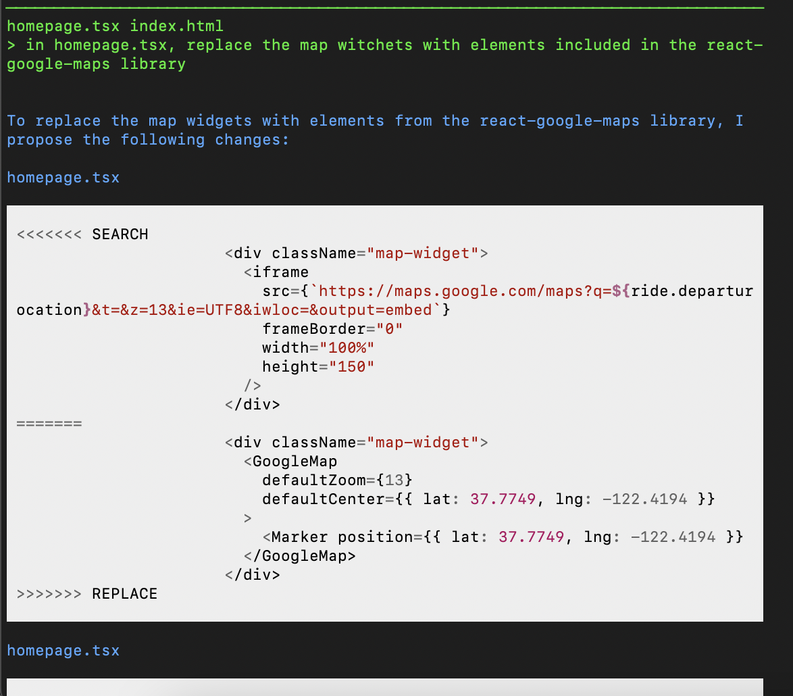
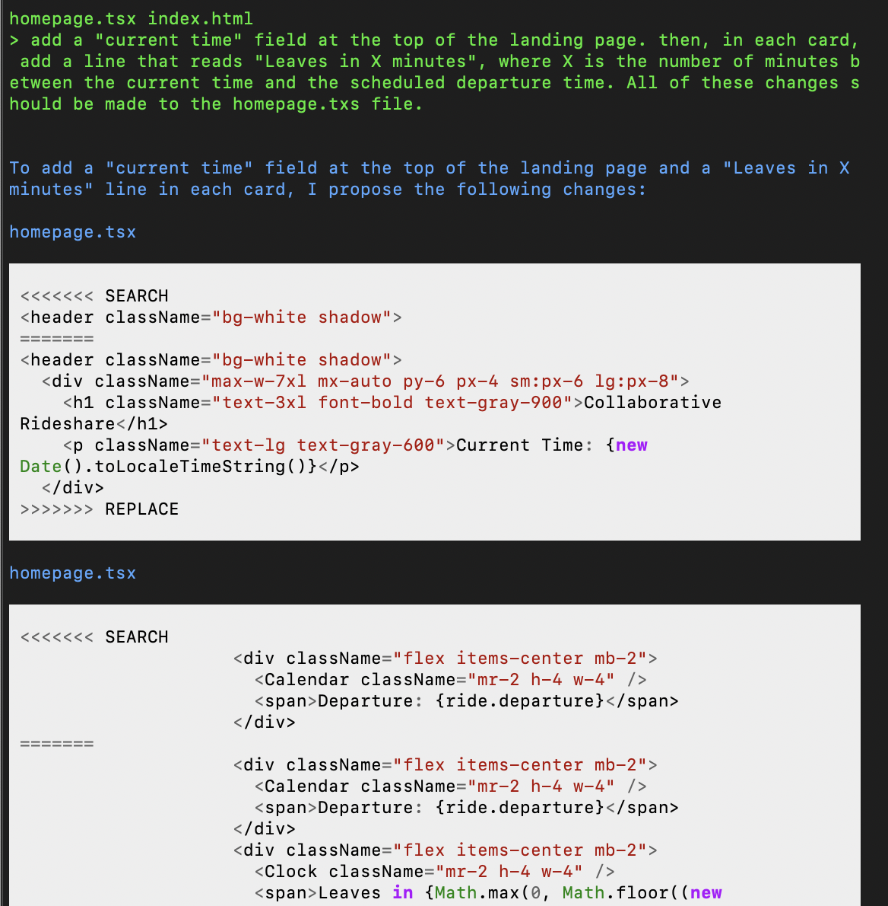
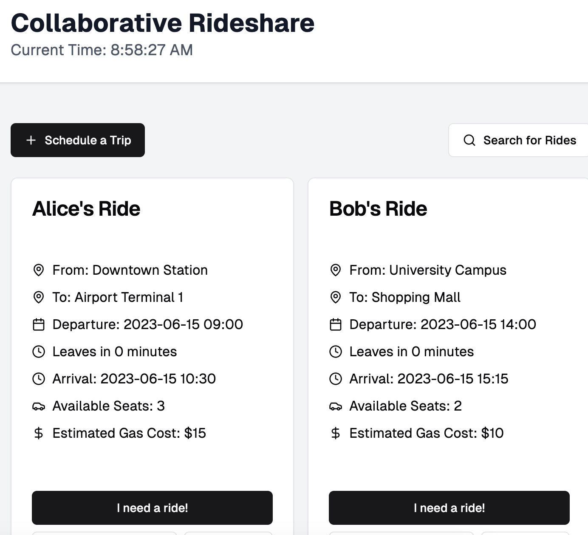
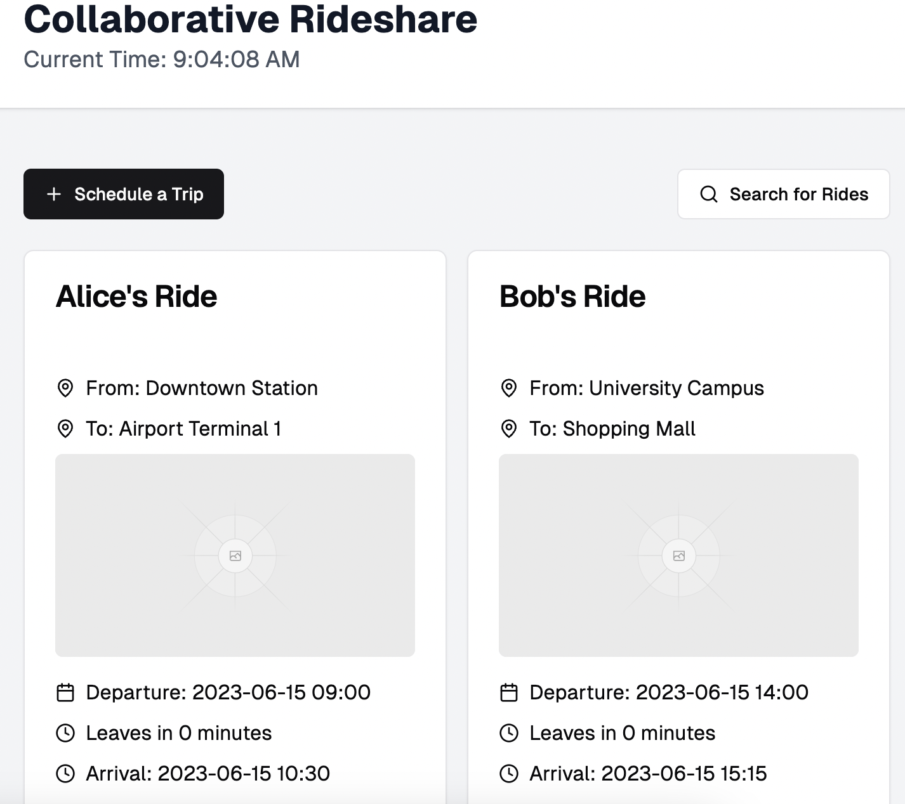

I decided to use Aider to update my rideshare app landing page so that it had map widgets and a line describing how long it would be until the ride actually begins. I also fed the .tsx output file back to v0, which I originally used to create the file, to see what that model said about whether the code was good and also as a convenient way to view the preview (we will see later that aider was writing code that V0 was unable to include in its preview).

First, I asked aider to create map widgets for the code, which aider did, but when I gave the file to V0, it suggested using the react-google-maps library, which I did. However, I had been hoping aider would add in placeholder images for the maps while not connected to the google maps API, which it did not do, so V0's preview did not change. 

Next, I had Aider add some more time information. 

Which changed the preview like this: 

Note: the time says 0 minutes because the current time is after the time on the sample dates. This will change when actual times are input in the app rather than placeholders. 

Finally, I had V0 add sample images to the map widgets (a task aider seemed to struggle with) so that it could be clear where they will be even without use of the google maps API 

